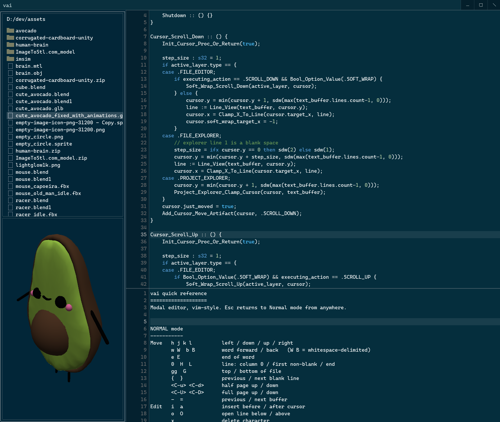

# vai



vai is a modal GUI code editor written in jai (similar to C++), based heavily on vi/vim/neovim. The #1 goal of the project is to provide an always-responsive text editor without hitching or hangs. Tied for #2 are: smooth scrolling, a file system navigator that uses vim motions, 3D and 2D asset previews, and split-based view layout configuration with collapsing views.

vai is under development. Currently only Windows (+OpenGL) is supported.

## Highlights

- vi-style normal, insert, visual, command, and view-resize modes
- Multiple views with both keyboard and mouse double-click and drag-based resizing, collapsible tabs, and layouts that persist per-project
- File and project explorers with asynchronous text, image, and lit 3D model previews, extensible with DLLs
- Buffer navigation, search, undo/redo, repeat, yank/paste, and configurable soft wrapping
- Syntax highlighting with tree-sitter (jai only at the moment)

## Build

You need Windows, the .jai compiler, CMake, and the Visual Studio 2019 C++ Build Tools with a Windows SDK.

```powershell
jai build.jai
.\bin\vai.exe
```
