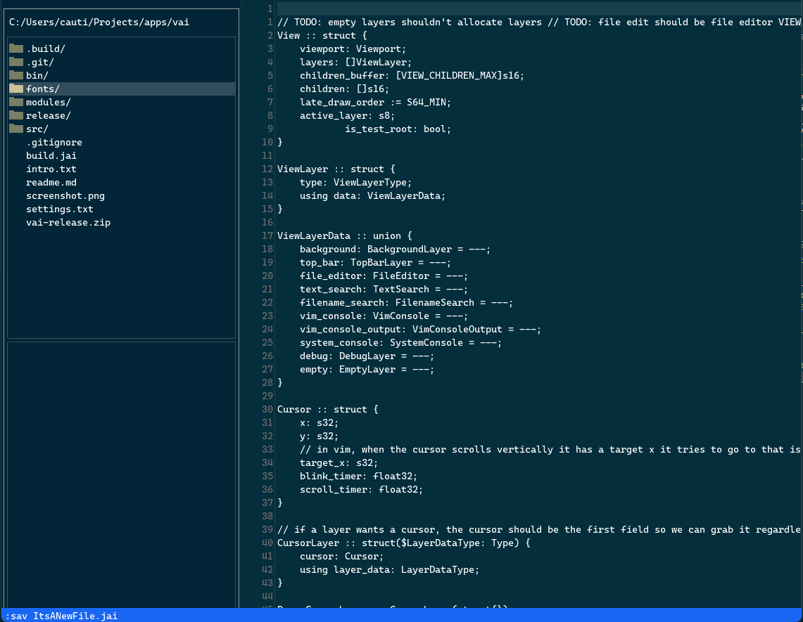

# Vai

A gui vim replacement written in Jai, with these goals: 

<ul>
    <li>never interrupt the text editing experience with laggy complex features</li>
    <li>some language integration</li>
    <li>removing common tool window friction</li>
    <ii>cross platform</li>
</ul>

Vai currently does function as a text editor, but it is missing important features that make it worth using. Once I'm finished with making it a basic vim replacement, I'll start working on some nice features. Note that I'm writing this thing for myself, but hopefully there are other people out there who find it useful.

Currently this is explicitly win32/opengl-based, so Windows-only for now, and the cross platform part will come later.
